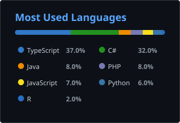
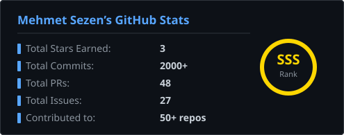

 

 

---

## 👨‍💻 About Me

Full-stack developer based in **Istanbul, Turkey**, pursuing a double major in **Software Engineering** and **Computer Engineering** at Istanbul Aydın University. I thrive in fast-paced environments, building everything from enterprise SaaS platforms and mobile apps to AI-powered medical systems.

- 🎓 **Erasmus+** — Silesian University, Katowitce, Poland (2024–2025)
- 💼 **Fullstack Developer** @ Desibona — React, Next.js, ASP.NET Core, Azure
- 🔬 **Cancer Research Intern** @ Istanbul University — 95%+ accurate CNN models
- 🌍 **Turkish** (native) · **English** C1 · **Polish** A1
- ⚡ Currently building: industrial waste tracking & GHG Reporting Tools & SaaS platforms & medical AI
- 📄 CVs available in this repo — [Standard CV](./Mehmet%20Sezen%20CV.pdf) · [Europass CV](./mehmet-sezen-europass%20(1).pdf)
- 📧 **mehmet.sezen19072@gmail.com**

 

---

## 🛠️ Tech Stack

**Languages**

**Frontend & Mobile**

**Backend & APIs**

**Databases & Storage**

**Cloud, DevOps & Tools**

**AI & Machine Learning**

---

## 🚀 Featured Projects

<table>
<tr>
<td width="50%" valign="top">

### 🏭 ATIS-KATIS
**Industrial & Hazardous Waste Tracking System**

Full-stack monorepo (web + mobile + API) — 8 Dockerized services, 25 REST controllers, 40+ DB tables, real-time SignalR notifications, and 6 role-based access levels across 6 waste form types with multi-step approval workflows.

`ASP.NET Core 9` `Next.js 16` `PostgreSQL` `Redis` `React Native` `Expo` `Docker` `SignalR` `SeaweedFS` `JWT`

</td>
<td width="50%" valign="top">

### 📊 Enterprise SaaS Platform *(NDA)*
**Real-Time Brand & Data Monitoring**

Full-product SaaS with real-time data aggregation, AI-driven risk scoring, semantic analysis, anomaly detection, and a cross-platform mobile app. Details withheld under NDA.

`Java 21` `Spring Boot 4` `MySQL` `React Native` `Expo` `TypeScript` `OpenAI SDK` `JWT`

</td>
</tr>
<tr>
<td width="50%" valign="top">

### 🛍️ MijnButik
**Production E-Commerce Platform**

High-performance storefront with separate admin panel, Azure cloud infrastructure, optimized MSSQL queries, and full CI/CD pipeline. Live at mijnbutik.com.

`Next.js` `React` `TypeScript` `ASP.NET Core` `Azure` `MSSQL` `Vercel`

</td>
<td width="50%" valign="top">

### 🧠 Medical AI Platform (IU-ML)
**Multi-Cancer Classification — 95%+ Accuracy**

Microservices medical imaging system for brain cancer, MS, lung cancer & Alzheimer's diagnosis. CNN models (ResNet50, BaseLineCNN), Next.js frontend, Clerk auth, and dual backend (ASP.NET Core + Django).

`Next.js` `ASP.NET Core` `Django` `TensorFlow` `XGBoost` `ResNet50` `MSSQL` `Python`

</td>
</tr>
<tr>
<td width="50%" valign="top">

### 📚 Mijn Sistem
**Full-Stack Business Management Platform**

Multi-service enterprise platform — customer frontend, admin panel, and C# REST backend. Separate repos under a shared architecture, built for Mijn Sistem.

`TypeScript` `C#` `Next.js` `ASP.NET Core`

</td>
<td width="50%" valign="top">

### 🎵 Soundchart
**Music Statistics Visualization App**

Interactive web app visualizing music usage data with D3.js charts, ASP.NET Core MVC backend, and a Vite.js frontend. Built as a Software Architecture course project.

`ASP.NET Core` `Vite.js` `D3.js` `MSSQL` `C#` `TypeScript`

</td>
</tr>
<tr>
<td width="100%" valign="top" colspan="2">

### 🌿 ESG & Sustainability Suite
**Environmental Tracking & Reporting Apps**

A collection of sustainability-focused tools: ESG reporting, enterprise sustainability tracking, and a SustainView data visualization app.

`TypeScript` `Next.js` `React`

</td>
</tr>
</table>

---

## 📈 GitHub Stats

  
  &nbsp;&nbsp;
  

 

  

---

## 📊 Activity Graph

  

---

## 🐍 Contribution Snake

  <picture>
    <source media="(prefers-color-scheme: dark)" srcset="https://raw.githubusercontent.com/ShiningDespair/ShiningDespair/output/github-contribution-grid-snake-dark.svg"/>
    <source media="(prefers-color-scheme: light)" srcset="https://raw.githubusercontent.com/ShiningDespair/ShiningDespair/output/github-contribution-grid-snake.svg"/>
    
  </picture>

<!--
  Snake animation setup — create .github/workflows/snake.yml in your profile repo:

  name: Generate Snake
  on:
    schedule: [{ cron: "0 0 * * *" }]
    workflow_dispatch:
  jobs:
    generate:
      runs-on: ubuntu-latest
      steps:
        - uses: Platane/snk@v3
          with:
            github_user_name: ${{ github.repository_owner }}
            outputs: |
              dist/github-contribution-grid-snake.svg
              dist/github-contribution-grid-snake-dark.svg?palette=github-dark
        - uses: crazy-max/ghaction-github-pages@v3
          with:
            target_branch: output
            build_dir: dist
          env:
            GITHUB_TOKEN: ${{ secrets.GITHUB_TOKEN }}
-->

---

## 🤝 Connect With Me

.pdf)

 

  

